# BikeMaster Deluxe — Albero Strategico della Roadmap

*Generato: 2026-07-12 — Documento di supporto decisionale (non plan trimestrale).*
*North Star: trasformare BikeMaster in piattaforma di simulazione sportiva.*

> Come leggere l'albero: la radice è la **visione Deluxe**. Da lì partono 3 percorsi
> strategici che NON sono mutualmente esclusivi — nel pratico si percorrono in parallelo
> con pesi diversi. Ogni percorso ha un nodo "prossimi 2 passi" già scomposto.
> I colori seguono la convenzione discussa: 🔵 consolidare · 🟠 physics engine · 🟢 world renderer/twin.

## Albero (Mermaid)

```mermaid
flowchart TD
    ROOT["🎯 BikeMaster Deluxe<br/>Piattaforma di simulazione sportiva"]

    ROOT --> A["🔵 A · Consolidare (minor rischio)<br/>Chiude priorità README + rende affidabili i dati"]
    ROOT --> B["🟠 B · Physics Engine (terreno già fatto)<br/>calories/fatigue/power già presenti"]
    ROOT --> C["🟢 C · World Renderer / Digital Twin (più rischioso)<br/>aethermap già in corso, va allineato"]

    %% ---- Percorso A: Consolidare ----
    A --> A1["A1 · PostgreSQL in produzione<br/>postgres_db.py + async_db esistono<br/>manca: Alembic su Render + smoke test"]
    A --> A2["A2 · Coverage >90%<br/>core/calculators 100% · engine 27% · pipeline 48%<br/>pytest-cov già cablato"]
    A --> A3["A3 · iOS build (ROADMAP P1.1)<br/>Capacitor Android esiste, iOS non verificato"]
    A --> A4["A4 · Logging + lifespan (ROADMAP P0.1/P0.2)<br/>structured logging + servizi nel lifespan FastAPI"]
    A --> ANEXT["➡️ A · PROSSIMI 2 PASSI"]
    ANEXT --> A5["1 · Alzare engine/pipeline a >80%<br/>con test mirati (oggi 27%/48%)"]
    ANEXT --> A6["2 · Chiudere PostgreSQL prod<br/>+ Alembic migration + deploy Render"]

    %% ---- Percorso B: Physics Engine ----
    B --> B1["B1 · Estrarre PhysicsCore<br/>calories.py (drag+aero+gravity) · fatigue.py · power.py<br/>→ moduli puri e indipendenti"]
    B --> B2["B2 · Validazione con dati reali<br/>stima potenza/HR vs misurato su ride reali"]
    B --> B3["B3 · Loop di simulazione real-time<br/>physics step per timestamp GPS"]
    B --> B4["B4 · Knowledge Engine<br/>advanced.py ha già 14 modelli matematici"]
    B --> BNEXT["➡️ B · PROSSIMI 2 PASSI"]
    BNEXT --> B5["1 · PhysicsCore con interfacce pure<br/>+ test unit (stile Clean Architecture)"]
    BNEXT --> B6["2 · Dataset di validazione potenza<br/>sulle ride reali dell'utente"]

    %% ---- Ponte verso Deluxe: Simulation Engine (Fase 6) ----
    B --> SIM["🟡 SIM · Simulation Engine (Fase 6)<br/>'what-if' = primo milestone user-facing Deluxe"]
    SIM --> SIM1["SIM1 · API what-if su tratta esistente<br/>'se cambio bici/vento/peso, quanto miglioro?'"]
    SIM --> SIM2["SIM2 · UI simulazione nel frontend<br/>pannello su rides reali"]

    %% ---- Percorso C: World Renderer / Digital Twin ----
    C --> C1["C1 · Audit aethermap<br/>Fasi AM1-AM5 in aethermap/src"]
    C --> C2["C2 · Allineare aethermap a Fase 7 Deluxe<br/>o dichiararlo R&D permanente"]
    C --> C3["C3 · SVO terrain + ECEF transform<br/>branch inconclusive-pastry (camera/SVO/ASCII)"]
    C --> C4["C4 · Digital twin objects<br/>twin/objects.py · twin/world.py"]
    C --> CNEXT["➡️ C · PROSSIMI 2 PASSI"]
    CNEXT --> C5["1 · Decidere confini<br/>aethermap prodotto vs R&D separato"]
    CNEXT --> C6["2 · Contratto dati rides↔world model<br/>GPSPoint/Ride → terrain input"]

    %% ---- Dipendenze trasversali ----
    A2 -.dati affidabili.-> B2
    A6 -.DB unica.-> B6
    B1 -.physics step.-> SIM1
    C6 -.terrain.-> SIM2
    C3 -.rendering.-> SIM2
```

## Legenda dei percorsi

| Percorso | Colore | Rapporto valore/sforzo | Stato reale nel repo |
|---|---|---|---|
| **A · Consolidare** | 🔵 | Alto / Basso | P0.1–P0.2, P1.1, P3.5 aperti in `ROADMAP.md` |
| **B · Physics Engine** | 🟠 | Alto / Medio | `calories.py`, `fatigue.py`, `power.py`, `advanced.py` completi |
| **C · World Renderer/Twin** | 🟢 | Medio/Basso / Alto | `aethermap/` AM1✅ AM2✅ AM3–5🔄 (scollegato) |
| **SIM · Simulation (Fase 6)** | 🟡 | Alto / Medio | Da costruire sopra B + dati di A |

## Ordine di sblocco suggerito (sequenza, non gerarchia)

1. **A** per primo — senza dati affidabili (Postgres + coverage) ogni stima fisica è fragile.
2. **B** subito dopo — il codice esiste già, serve solo incapsularlo e validarlo.
3. **SIM** come primo traguardo "Deluxe" visibile all'utente, appoggiandosi a B.
4. **C** solo dopo aver deciso esplicitamente se `aethermap` converge nel prodotto.

## Aggiornamento fusione (2026-07-12)

Durante l'esplorazione è emerso che **`bike_analyzer/bm2/` è già un "BikeMaster 2.0"
completo** — motore di simulazione con filosofia diversa (`Quantity`+`UnitRegistry`
con analisi dimensionale, framework ad algoritmi `Algorithm`→`ModelResult`, dominio
proprio `AnalysisContext(Athlete,Bike,WorldObject,Activity)`, `SimulationEngine`
what-if/preset/sensitivity, `AIOrchestrator` con agenti NL). È **già cablato**
(`bm2_routes.py`, montato in `app_factory.py`) e ha test dedicati (`test_bm2_*`).

### Decisione: un solo kernel numerico
Esistevano **due forward model fisici** duplicati: `bm2`'s `Algorithm._cycling_forces`
e `core/physics.power`. Fusione eseguita:
- `core/physics/` è ora il **kernel numerico unico** (`cycling_forces`,
  `instantaneous_power`, `required_speed_for_power`, `grade_between`), con
  convenzioni allineate a `bm2` (gradiente lineare, divisione per η drivetrain).
- `bm2.algorithms.base.Algorithm._cycling_forces` e `bm2.algorithms.power_model`
  (`_power_for_speed`, `_speed_for_power`) **delegono a `core.physics`**.
- Test: 87 verdi (`test_core_physics` + `test_bm2_*`).

### Conseguenza sulla roadmap
- **Fase 4 (Physics Engine)** e **Fase 6 (Simulation "what-if")** della visione
  Deluxe sono in larga parte **già presenti dentro `bm2`**, non da scrivere ex novo.
- Il vero lavoro restante è: (a) **integrare `bm2` col flusso `Ride`/analytics**
  esistente (oggi è un sottosistema isolato, non citato in `ROADMAP.md`) — **fatto**
  (adapter `bm2/adapters.py` + `POST /api/v1/bm2/simulate-ride`);
  (b) **validazione su dati reali** (potenza/HR misurate) — manca in entrambi;
  (c) documentare `bm2` in `ROADMAP.md`/`PROJECT_STATUS.md` — **fatto** (Track D +
      sottosistema in `PROJECT_STATUS.md` + nota in `AGENTS.md`).

## Note di rischio (dal confronto visione ↔ repo)

- **Scope creep**: il prodotto ha già una roadmap propria (`ROADMAP.md` Track A) con item
  production-ready in sospeso. La visione Deluxe non deve cannibalizzare quelli.
- **Duplicazione aethermap**: `aethermap/` e il branch `inconclusive-pastry` avanzano in modo
  scollegato dalla Fase 7 della visione. Va presa una decisione di ownership (C5).
- **Validazione fisica**: B2/B6 richiedono dati reali (potenza/HR) per non generare stime fuorvianti
  — è lavoro data-science, non solo ingegneria.
