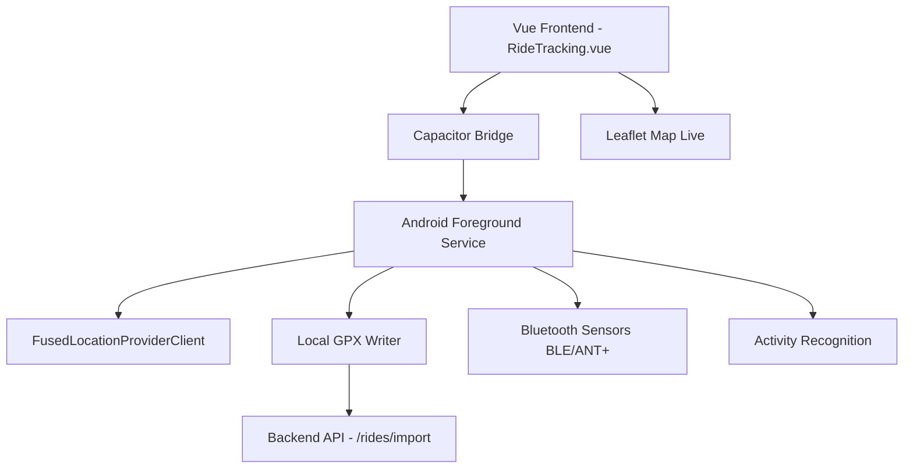

# Phone GPS Tracking - Documentazione Tecnica

**Feature**: `Phone GPS Tracking`  
**Versione**: 1.0 (MVP)  
**Data**: Giugno 2026  
**Progetto**: BikeMaster  

## 1. Introduzione

Questa funzionalità permette agli utenti di registrare le proprie uscite in bicicletta **direttamente dal telefono** (principalmente Android), senza necessità di dispositivi Garmin, Wahoo o altre head-unit.

**Obiettivo principale**: Creare un'esperienza di tracking nativa, affidabile e ottimizzata, simile a Strava/Komoot, perfettamente integrata con il motore di analisi e AI Coach di BikeMaster.

## 2. Requisiti Funzionali

### Utente Finale
- Avviare / mettere in pausa / riprendere / terminare una uscita
- Visualizzare in tempo reale: mappa, distanza, velocità istantanea e media, dislivello, tempo, potenza stimata (se sensori disponibili)
- Registrazione automatica in background con notifica persistente
- Salvataggio locale sicuro (GPX) in caso di problemi di connessione
- Sincronizzazione automatica con il backend al termine dell'uscita

> Architettura completa del salvataggio dati sul dispositivo (Local Storage,
> Service Worker, Background Sync, GPX locale, IndexedDB):
> [local-data-storage.md](./local-data-storage.md).
- Supporto sensori Bluetooth (HR, Cadence, Power)

### Requisiti Tecnici
- Android 10+ (target 12+)
- Capacitor + Kotlin nativo
- Precisione GPS alta
- Ottimizzazione batteria
- Esportazione GPX/FIT compatibile con il parser esistente del backend

## 3. Architettura



## 4. Permessi Richiesti (AndroidManifest.xml)

```xml
<uses-permission android:name="android.permission.ACCESS_FINE_LOCATION" />
<uses-permission android:name="android.permission.ACCESS_BACKGROUND_LOCATION" />
<uses-permission android:name="android.permission.FOREGROUND_SERVICE" />
<uses-permission android:name="android.permission.FOREGROUND_SERVICE_LOCATION" />
<uses-permission android:name="android.permission.ACTIVITY_RECOGNITION" />
<uses-permission android:name="android.permission.BLUETOOTH_SCAN" />
<uses-permission android:name="android.permission.BLUETOOTH_CONNECT" />
```

## 5. Implementazione

### 5.1 Foreground Service (`BikeTrackingService.kt`)
Vedi file: `android/app/src/main/java/com/bikemaster/tracking/BikeTrackingService.kt`

### 5.2 Store Pinia (`trackingStore.ts`)
Vedi file: `frontend/src/stores/trackingStore.ts`

### 5.3 Pagina Vue (`RideTracking.vue`)
Vedi file: `frontend/src/views/RideTracking.vue`

## 6. Frontend (Vue 3)

**Componenti**:
- `LiveMap.vue` - Mappa Leaflet con polyline in tempo reale
- `RideMetricsPanel.vue` - Velocità grande, distanza, dislivello, tempo
- `ControlsBar.vue` - Pulsanti Pausa / Fine

## 7. Backend Integration

**Endpoint**: `POST /rides/import` (GPX/FIT)

**Flusso**:
1. Fine uscita → converti in GPX standard
2. Upload automatico
3. Backend processa → crea Ride + calcola metriche + AI Coach
4. Notifica push all'utente

## 9. Health Connect (Android)

Android Health Connect integration for reading/writing health data directly from the system health store.

### Permessi Richiesti

| Data Type | Read | Write |
|---|---|---|
| Weight | ✅ | ✅ |
| Heart Rate | ✅ | ✅ |
| Steps | ✅ | ✅ |
| Exercise Session | ✅ | ✅ |
| Height | ✅ | ✅ |
| Body Fat | ✅ | ✅ |

### Componenti

- `HealthConnectManager.kt` — SDK availability check, permission controller, record read/write flows
- `BleManager.kt` — BLE scan for weight scale, heart rate, cycling speed/cadence services
- `RunstarBleConnector.kt` / `RunstarDecoder.kt` — Runstar scale specific BLE protocol decoder
- `ConnectorManager.kt` — abstraction layer selecting Health Connect vs BLE vs other connectors

### Architettura

```
Vue Frontend (HealthPanel)
    ↓ Capacitor Bridge
Android App (HealthConnectManager + BleManager)
    ↓
Android Health Connect SDK / BLE GATT
    ↓
Backend API (POST /api/v1/athletes/{id}/metrics)
```

## 10. Roadmap di Sviluppo

| Fase | Descrizione | Durata | Priorità |
|------|-------------|--------|----------|
| 0 | Preparazione & Plugin | 4 giorni | Alta |
| 1 | Core Tracking Service | 10-12 giorni | Alta |
| 2 | UI Tracking | 8 giorni | Alta |
| 3 | Sensori & Ottimizzazioni | 7 giorni | Media |
| 4 | Backend Integration | 5 giorni | Alta |
| 5 | Testing & Bugfix | 8 giorni | Alta |

**Totale MVP**: 6-8 settimane