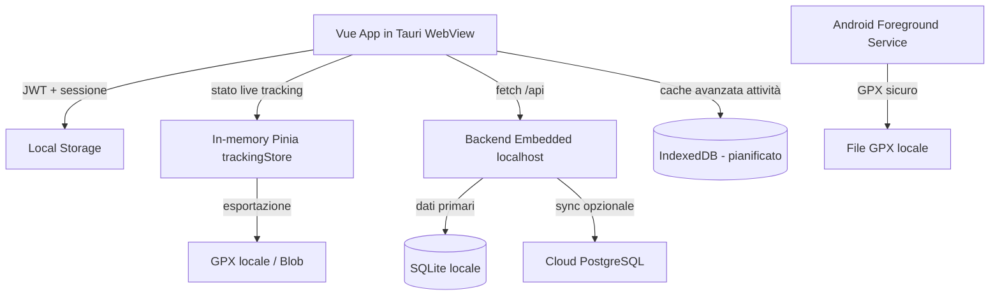

# Salvataggio Dati sui Dispositivi degli Utenti

**Progetto:** BikeMaster · **Frontend:** Vue 3 + Vite + TypeScript (Tauri 2 WebView / PWA) · **Desktop:** Tauri 2 (Rust + WebView) · **Native:** Capacitor (Android/iOS)

Questo documento descrive in modo unitario **come e dove BikeMaster salva i dati
sul dispositivo dell'utente**, in ottica *local-first*. È il riferimento
centrale a cui si appoggiano `PHONE_TRACKING.md`, `frontend.md`,
`docs/agent/auth.md` e la Cookie Policy.

Nell'architettura local-first, **il device è la sorgente di verità**. Ogni utente
ha una copia completa dell'app con SQLite locale. Il cloud è opzionale e serve
solo per sincronizzazione e funzionalità social.

---

## 1. Principi

- **Local-first:** l'app deve avviarsi e restare utilizzabile anche senza
  rete; le uscite GPS non devono mai essere perse per mancanza di connessione.
- **Device-complete:** ogni dispositivo ha una copia completa dell'app con
  database SQLite locale. I dati dell'utente (profilo, attività, health data)
  risiedono primariamente in locale, non su un server centrale.
- **Sync contrattata:** l'utente decide se e quando sincronizzare con il cloud.
  La sincronizzazione è bidirezionale ma sempre opzionale.
- **Minimo necessario:** sul dispositivo finiscono tutti i dati dell'utente.
  Il cloud riceve solo copie se l'utente attiva la sync.
- **Pulizia esplicita:** l'utente può cancellare i dati locali (logout,
  revoca permessi, disinstallazione) e il backend espone il diritto alla
  cancellazione (GDPR, vedi `PRIVACY_POLICY_STORE.md`).

---

## 2. Livelli di storage sul dispositivo

### 2.1 Local Storage — token e sessione

Gestito in `frontend/src/utils/auth-storage.ts` e usato da `stores/auth.ts`,
`router/index.ts` e `main.ts`.

| Chiave | Contenuto | Note |
|---|---|---|
| `bikemaster_token` | JWT di accesso | Letto/scritto da `localStorage` |
| `bikemaster_user` | Payload utente corrente | |
| `bikemaster_just_logged_in` | Flag post-login | Pulito DOPO `next()` nel guard |
| `bikemaster_refresh_token` | Refresh token | Rinnovo automatico sessione |
| `bikemaster_login_error` | Errore login OAuth | |
| `bikemaster_oauth_loading` | Stato loading OAuth | |
| `bikemaster_chunk_reload_at` | Timestamp ricarica chunk | |

Caratteristiche:
- Il `router.beforeEach` **sincronizza Pinia da `localStorage`** prima di
  valutare l'auth, così l'app ripristina la sessione al reload.
- Su `401` (senza `suppressAuthClear`) `utils/api.ts` chiama `clearAuth()` →
  rimuove le chiavi e mostra il toast "Sessione scaduta" (logout silenzioso).
- **Non adatto a dati voluminosi/strutturati**: solo piccoli valori di
  sessione (stringhe).

> Dettaglio flusso in `docs/agent/auth.md`.

### 2.2 In-memory (Pinia `trackingStore`)

`frontend/src/stores/trackingStore.ts` mantiene lo stato live del tracking
(`isTracking`, `routePoints: GpsPoint[]`, metriche, `gpxBlob`/`gpxPath`).
È **volatile**: perso al reload della pagina, ma alimenta `toGpx()` che
genera il file GPX standard pronto per il backend.

### 2.3 GPX locale (Phone Tracking)

In caso di problemi di connessione, l'uscita viene salvata in **GPX locale**
prima del caricamento. Su Android è delegato al `BikeTrackingService.kt`
(Local GPX Writer), su web app è il `Blob` prodotto da `trackingStore.toGpx()`.
Vedi `PHONE_TRACKING.md` §2 (Salvataggio locale sicuro) e §3 (architettura).

### 2.4 Backend Embedded (Tauri Desktop)

Su desktop (Tauri), il backend FastAPI o Axum gira come processo embedded
sullo stesso device, comunicando con il frontend via `localhost`.
Il database primario è SQLite (file locale).

| Componente | Dove | Note |
|---|---|---|
| API server | `localhost` (processo embedded) | FastAPI (Python) o Axum (Rust) |
| Database | File SQLite sul disco | Dati primari, no server centrale |
| Sync service | `localhost` | Bidirezionale, attivato su scelta utente |

Su web (PWA), il backend è il server cloud opzionale. Le chiamate `/api`
possono essere dirette al backend locale (se disponibile) o al cloud.

### 2.5 Sync Service — coda upload e sincronizzazione

Le `POST /api/v1/rides/*` passano per il sync service embedded. Se la sync
cloud è attiva e la rete non risponde, la richiesta viene accodata
localmente e reinviata automaticamente quando la connessione ritorna.

> Nell'architettura local-first, il backend locale (SQLite) è sempre disponibile.
> La coda serve solo per la sincronizzazione con il cloud, non per la funzionalità
> base dell'app.

### 2.6 IndexedDB — cache avanzata attività

`idb@^7.0.1` (in `package.json`) wrappa un DB locale `bikemaster-local`
(versione 1) con due object store:

- `rides` (keyPath `id`): ultime attività con `cachedAt`, usate per la lettura
  offline-first.
- `meta` (key-value): ultimo `summary` delle attività (`summary`).

Modulo: `frontend/src/utils/localRideCache.ts` (`cacheRides`,
`getCachedRides`, `removeCachedRide`, `cacheSummary`, `getCachedSummary`,
`clearLocalRideCache`). È resiliente: se `indexedDB` non è disponibile
(es. SSR/test) degrada a no-op e `useRides.fetchSummary()` cade sul fallback
vuoto senza rompersi.

Flusso in `useRides.ts`:
- `fetchSummary()` prova la rete; in caso di successo **cache-a** ride+summary;
  in caso di errore di rete restituisce lo `summary` cache-ato, oppure le ride
  cache-ate (ricalcolando gli aggregati), infine il fallback vuoto.
- `deleteRide(id)` rimuove anche la ride dalla cache locale.

Citato nella Cookie Policy (`IndexedDB: per caching avanzato di dati di
attività`). Test: `src/utils/localRideCache.test.ts` (con `fake-indexeddb`).

### 2.7 Native (Android / iOS)

- **Android:** `Shared Preferences` per sessione/preferenze; file system per
  GPX locale (`BikeTrackingService.kt`). Permessi in `PHONE_TRACKING.md` §4.
- **iOS:** plugin Capacitor Swift speculare (vedi `frontend.md` §Native).

---

## 3. Flussi chiave

### 3.1 Avvio app / ripristino sessione (Desktop Tauri)
1. `main.ts` eventualmente legge token OAuth da URL (`setAuthFromUrl`).
2. `router.beforeEach` sincronizza `auth.token`/`auth.user` da `localStorage`.
3. Se token valido → dashboard; se scaduto → `clearAuth()` + toast.
4. Backend embedded si avvia automaticamente, apre SQLite locale.

### 3.2 Tracking offline → GPX → sync
1. `trackingStore` accumula `routePoints` in memoria.
2. Fine uscita → `toGpx()` produce GPX; su nativo salvataggio su file.
3. Upload al backend embedded locale → salvataggio SQLite.
4. Se sync cloud attiva → accodamento per sincronizzazione successiva.
5. Al ritorno rete → sync reinvia al cloud se attiva.

### 3.3 Invalidazione cache
- Auth: mai cache-ato.
- Ride/API: aggiornamenti post-sync richiedono invalidazione manuale
- Static: rinnovato a ogni deploy.

---

## 4. Privacy e sicurezza

- I token JWT stanno in `localStorage` (non HttpOnly): esposti a XSS — da
  monitorare. Opzione futura: cookie `HttpOnly` + refresh via `security.py`.
- I dati GPS grezzi restano sul dispositivo solo il tempo necessario al
  caricamento; non vengono usati per altri scopi (vedi `PRIVACY_POLICY_STORE.md` §6).
- SQLite locale contiene tutti i dati dell'utente: vanno cancellati al
  logout/disinstallazione (GDPR diritto all'oblio).
- La Cookie Policy elenca Local Storage, Session Storage e IndexedDB come
  strumenti di tracciamento alternativi (`src/views/CookiePolicy.vue`).

---

## 5. Riferimenti / file

| File | Ruolo |
|---|---|
| `frontend/src/utils/auth-storage.ts` | Chiavi Local Storage |
| `frontend/src/stores/auth.ts` | Gestione JWT/sessione |
| `frontend/src/stores/trackingStore.ts` | Stato live + `toGpx()` |
| `frontend/src/utils/localRideCache.ts` | Cache IndexedDB attività (offline-first) |
| `frontend/src/composables/useRides.ts` | Lettura/scrittura ride + fallback cache |
| `frontend/src/router/index.ts` | Sync Local Storage → Pinia |
| `frontend/src/sw.js` | Service Worker (PWA web) |
| `src-tauri/tauri.conf.json` | Configurazione app desktop |
| `frontend/vite.config.js` | Config PWA / runtime caching |
| `frontend/android/.../BikeTrackingService.kt` | GPX locale nativo |

**Collegati:** `PHONE_TRACKING.md`, `frontend.md`, `docs/agent/auth.md`,
`docs/agent/notes.md`, `PRIVACY_POLICY_STORE.md`, `docs/deployment-plan.md`.
