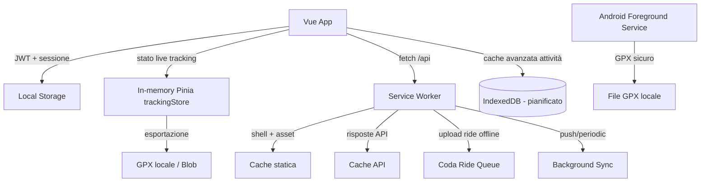

# Salvataggio Dati sui Dispositivi degli Utenti

**Progetto:** BikeMaster · **Frontend:** Vue 3 + PWA (vite-plugin-pwa) · **Native:** Capacitor (Android/iOS)

Questo documento descrive in modo unitario **come e dove BikeMaster salva i dati
sul dispositivo dell'utente**, in ottica *offline-first*. È il riferimento
centrale a cui si appoggiano `PHONE_TRACKING.md`, `frontend.md`,
`docs/agent/auth.md` e la Cookie Policy.

---

## 1. Principi

- **Offline-first:** l'app deve avviarsi e restare utilizzabile anche senza
  rete; le uscite GPS non devono mai essere perse per mancanza di connessione.
- **Minimo necessario:** sul dispositivo finiscono solo token di sessione,
  dati di cache e le tracce GPX in attesa di sincronizzazione. I dati sensibili
  (profilo, attività storiche) risiedono sul backend e vengono ri-cache-ati
  localmente solo in modo volatile/effimero.
- **Sync al termine:** ogni dato generato offline viene accodato e inviato al
  backend non appena la connessione ritorna (vedi Background Sync, §4.5).
- **Pulizia esplicita:** l'utente può cancellare i dati locali (logout,
  revoca permessi, disinstallazione) e il backend espone il diritto alla
  cancellazione (GDPR, vedi `PRIVACY_POLICY_STORE.md`).

---

## 2. Livelli di storage sul dispositivo

### 2.1 Local Storage — token e sessione

Gestito in `frontend/src/utils/auth-storage.ts` e usato da `stores/auth.ts`,
`router/index.ts` e `main.ts`.

| Chiave | Contenuto | Note |
|---|---|---|
| `bikemaster_token` | JWT di accesso | Letto/scritto da `localStorage` |
| `bikemaster_user` | Payload utente corrente | |
| `bikemaster_just_logged_in` | Flag post-login | Pulito DOPO `next()` nel guard |
| `bikemaster_refresh_token` | Refresh token | Rinnovo automatico sessione |
| `bikemaster_login_error` | Errore login OAuth | |
| `bikemaster_oauth_loading` | Stato loading OAuth | |
| `bikemaster_chunk_reload_at` | Timestamp ricarica chunk | |

Caratteristiche:
- Il `router.beforeEach` **sincronizza Pinia da `localStorage`** prima di
  valutare l'auth, così l'app ripristina la sessione al reload.
- Su `401` (senza `suppressAuthClear`) `utils/api.ts` chiama `clearAuth()` →
  rimuove le chiavi e mostra il toast "Sessione scaduta" (logout silenzioso).
- **Non adatto a dati voluminosi/strutturati**: solo piccoli valori di
  sessione (stringhe).

> Dettaglio flusso in `docs/agent/auth.md`.

### 2.2 In-memory (Pinia `trackingStore`)

`frontend/src/stores/trackingStore.ts` mantiene lo stato live del tracking
(`isTracking`, `routePoints: GpsPoint[]`, metriche, `gpxBlob`/`gpxPath`).
È **volatile**: perso al reload della pagina, ma alimenta `toGpx()` che
genera il file GPX standard pronto per il backend.

### 2.3 GPX locale (Phone Tracking)

In caso di problemi di connessione, l'uscita viene salvata in **GPX locale**
prima del caricamento. Su Android è delegato al `BikeTrackingService.kt`
(Local GPX Writer), su web app è il `Blob` prodotto da `trackingStore.toGpx()`.
Vedi `PHONE_TRACKING.md` §2 (Salvataggio locale sicuro) e §3 (architettura).

### 2.4 Service Worker — cache (shell, API, immagini)

`frontend/src/sw.js`, generato con `vite-plugin-pwa` (`strategies:
injectManifest`, `registerType: autoUpdate`).

| Cache | Strategia | TTL | Scope |
|---|---|---|---|
| `bikemaster-static-v7` | precache + navigate NetworkFirst | asset 24h | shell app, script/style |
| `bikemaster-api-v1` | NetworkFirst | 60s (100 entry) | `/api/*` generico |
| `bikemaster-api-v1` (auth) | NetworkFirst | 0s (10 entry) | `/api/*auth*` → **mai cache-ato** |
| `bikemaster-images-v1` | CacheFirst | 30 giorni (60 entry) | immagini |
| `bikemaster-ride-queue-v1` | Background Sync | 24h retention | coda upload ride offline |

- **Navigation handler** registrato *prima* di `precacheAndRoute`: fetch con
  `cache: "reload"` per evitare `index.html` stale con hash obsoleti; fallback
  alla shell cache in offline (altrimenti `503`).
- `cleanupOutdatedCaches()` + `activate` eliminano cache non più usate.
- `SKIP_WAITING` gestito via `postMessage` (vedi `docs/agent/notes.md`).

### 2.5 Background Sync — coda upload offline

Le `POST /api/v1/rides/*` passano per un `BackgroundSyncPlugin`
(`RIDE_QUEUE_CACHE`): se la rete non risponde, la richiesta viene accodata
nel Cache Storage e reinviata automaticamente all'evento `sync` (e al
`periodicsync` `"sync-rides"`, 24h di retention massima).

> ⚠️ **Dato stale:** la cache API su `/api` ha TTL breve (60s) ma le ride
> possono risultare stale dopo sync. Prevedere invalidazione esplicita
> (problema già tracciato in `docs/agent/notes.md`).

### 2.6 IndexedDB — cache avanzata attività

`idb@^7.0.1` (in `package.json`) wrappa un DB locale `bikemaster-local`
(versione 1) con due object store:

- `rides` (keyPath `id`): ultime attività con `cachedAt`, usate per la lettura
  offline-first.
- `meta` (key-value): ultimo `summary` delle attività (`summary`).

Modulo: `frontend/src/utils/localRideCache.ts` (`cacheRides`,
`getCachedRides`, `removeCachedRide`, `cacheSummary`, `getCachedSummary`,
`clearLocalRideCache`). È resiliente: se `indexedDB` non è disponibile
(es. SSR/test) degrada a no-op e `useRides.fetchSummary()` cade sul fallback
vuoto senza rompersi.

Flusso in `useRides.ts`:
- `fetchSummary()` prova la rete; in caso di successo **cache-a** ride+summary;
  in caso di errore di rete restituisce lo `summary` cache-ato, oppure le ride
  cache-ate (ricalcolando gli aggregati), infine il fallback vuoto.
- `deleteRide(id)` rimuove anche la ride dalla cache locale.

Citato nella Cookie Policy (`IndexedDB: per caching avanzato di dati di
attività`). Test: `src/utils/localRideCache.test.ts` (con `fake-indexeddb`).

### 2.7 Native (Android / iOS)

- **Android:** `Shared Preferences` per sessione/preferenze; file system per
  GPX locale (`BikeTrackingService.kt`). Permessi in `PHONE_TRACKING.md` §4.
- **iOS:** plugin Capacitor Swift speculare (vedi `frontend.md` §Native).

---

## 3. Flussi chiave

### 3.1 Avvio app / ripristino sessione
1. `main.ts` eventualmente legge token OAuth da URL (`setAuthFromUrl`).
2. `router.beforeEach` sincronizza `auth.token`/`auth.user` da `localStorage`.
3. Se token valido → dashboard; se scaduto → `clearAuth()` + toast.

### 3.2 Tracking offline → GPX → sync
1. `trackingStore` accumula `routePoints` in memoria.
2. Fine uscita → `toGpx()` produce GPX; su nativo salvataggio su file.
3. Upload `POST /rides/import`: in offline viene accodato (Background Sync).
4. Al ritorno rete → `sync` reinvia; backend crea Ride + metriche + AI Coach.

### 3.3 Invalidazione cache
- Auth: mai cache-ato (`maxAgeSeconds: 0`).
- Ride/API: TTL 60s; aggiornamenti post-sync richiedono invalidazione manuale
  (vedi nota §2.5).
- Static: rinnovato a ogni deploy (`skipWaiting` + cleanup cache).

---

## 4. Privacy e sicurezza

- I token JWT stanno in `localStorage` (non HttpOnly): esposti a XSS — da
  monitorare. Opzione futura: cookie `HttpOnly` + refresh via `security.py`.
- I dati GPS grezzi restano sul dispositivo solo il tempo necessario al
  caricamento; non vengono usati per altri scopi (vedi `PRIVACY_POLICY_STORE.md` §6).
- Directory locale (`RIDE_QUEUE_CACHE`, GPX) contengono dati di attività:
  vanno cancellate al logout/disinstallazione.
- La Cookie Policy elenca Local Storage, Session Storage e IndexedDB come
  strumenti di tracciamento alternativi (`src/views/CookiePolicy.vue`).

---

## 5. Riferimenti / file

| File | Ruolo |
|---|---|
| `frontend/src/utils/auth-storage.ts` | Chiavi Local Storage |
| `frontend/src/stores/auth.ts` | Gestione JWT/sessione |
| `frontend/src/stores/trackingStore.ts` | Stato live + `toGpx()` |
| `frontend/src/utils/localRideCache.ts` | Cache IndexedDB attività (offline-first) |
| `frontend/src/composables/useRides.ts` | Lettura/scrittura ride + fallback cache |
| `frontend/src/router/index.ts` | Sync Local Storage → Pinia |
| `frontend/src/sw.js` | Service Worker (cache + Background Sync) |
| `frontend/vite.config.js` | Config PWA / runtime caching |
| `frontend/android/.../BikeTrackingService.kt` | GPX locale nativo |
| `frontend/src/views/CookiePolicy.vue` | Dichiarazione storage lato client |

**Collegati:** `PHONE_TRACKING.md`, `frontend.md`, `docs/agent/auth.md`,
`docs/agent/notes.md`, `PRIVACY_POLICY_STORE.md`.
